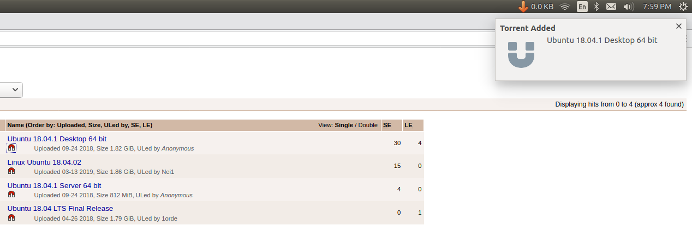

# cloud-torrent-extension  

A mozilla browser extension to directly add magnet links to [Cloud-Torrent](https://github.com/jpillora/cloud-torrent) or [Simple-Torrent](https://github.com/boypt/simple-torrent) server.

When users click right on a magnet link, there will be an option in the browser's context menu and clicking on it will send magnet link to Cloud Torrent which is specified in the setting.  
  
  

### Releases  
**version: 1.7b**  
*	Get Browser Notification whenever a magnet link is successfully added to the remote torrent server. To use this notification feature [download the patched binary v1.2.1](http://s000.tinyupload.com/index.php?file_id=89235351238068471330) or compile the latest patched version [ketankr9/simple-torrent](https://github.com/ketankr9/simple-torrent) or wait for it to be committed in the central repository.    

**version: 1.6b**  
* Now url links can also be added as magnet, solving [Issue#2](https://github.com/ketankr9/cloud-torrent-extension/issues/2)  

**version: 1.5b**
* Click on a magnet and it will be sent to the cloud torrent. Used protocol_handlers for handling magnets.  

**version: 1.4b**  
* Restrict Context Menu items to only links.
* Change Add-on Icon.  

**version: 1.3b**  
* Enabled Basic Authorization support. Now every Add-Magnet request includes torrent-server based cookie header and authorization header(if auth is enabled).  

### Future Goals  
* **Done** Enable a feedback mechanism like browser notification when a magnet has been sent to the server.  
